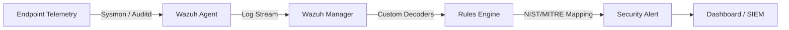

# Wazuh NIST CSF v2.0 Detection Rule Pack

[](https://wazuh.com)
[](https://www.nist.gov/cyberframework)
[](rules/)
[](tests/EVIDENCE_REPORT.md)
[](LICENSE)

---

> [!IMPORTANT]
> **Disclaimer:** This is a community-maintained project and is **not** an official Wazuh repository. It is not affiliated with, endorsed by, or sponsored by Wazuh Inc. Use at your own discretion.

---

## 💡 The Problem

Wazuh is incredibly powerful, but mapping custom detections to the new **NIST CSF v2.0** framework usually means hours of manual spreadsheet tracking and disconnected documentation. Most teams end up with alerts that fire but can't be traced to a compliance outcome — leaving auditors unsatisfied and analysts buried.

## 🎯 The Solution

This repository bridges the gap between detection logic and compliance evidence. It provides a **production-ready, rigorously tested set of 50 Wazuh rules** natively enriched with NIST CSF v2.0 and MITRE ATT&CK tags — so your alerts are compliance-ready the second they hit your dashboard.

> No manual spreadsheets. No guesswork. Every alert fires with its NIST subcategory and MITRE technique baked in.

---

## 🏗️ Architecture & Workflow



## 🧪 Lab Tested Environment

All rules have been validated against real telemetry sources in a controlled lab:

* **OS**: Ubuntu 22.04 LTS & Windows Server 2022
* **Wazuh**: Manager & Agent v4.8.0
* **Telemetry**: Sysmon (Windows), Auditd & Syslog (Linux)
* **Validation**: Automated evidence harness — [57 PASS, 0 FAIL](tests/EVIDENCE_REPORT.md)

---

## 🚀 Quick Start

### Prerequisites

Before deploying, confirm your environment meets these requirements:

- **Wazuh Manager** v4.8.0 or later
- **Root access** to the Wazuh Manager host
- **Endpoints configured** with the required telemetry agents:
  - Windows: [Sysmon + Audit Policy](docs/prerequisites.md)
  - Linux: [Auditd + iptables logging](docs/prerequisites.md)
- **CDB list references** added to `ossec.conf` (see Step 3 below)

### 1. Clone & Deploy

```bash
git clone https://github.com/Sbharadwaj05/Wazuh-NIST-Rules-Set.git
cd Wazuh-NIST-Rules-Set
```

Copy rules and decoders to your Wazuh Manager:

```bash
sudo cp -r rules/*  /var/ossec/etc/rules/nist-csf/
sudo cp decoders/nist_custom_decoders.xml /var/ossec/etc/decoders/
sudo cp lists/rare-ports lists/c2-domains /var/ossec/etc/lists/
```

See the full [Deployment Guide](docs/deployment-guide.md) for detailed steps.

### 2. Register CDB Lists

Add the following inside the `<ruleset>` block in `/var/ossec/etc/ossec.conf`:

```xml
<list>etc/lists/rare-ports</list>
<list>etc/lists/c2-domains</list>
```

### 3. Restart Wazuh Manager

```bash
sudo systemctl restart wazuh-manager
```

### 4. Run Automated Validation

```bash
# Static evidence validator (no Wazuh required)
python tests/evidence_validator.py

# Full wazuh-logtest harness (requires live Wazuh)
bash tests/test-runner.sh
```

---

## 🔥 Example Alert Output

Every alert triggered by this pack is natively enriched with MITRE ATT&CK context and NIST CSF tags directly in the Wazuh JSON event:

```json
{
  "rule": {
    "level": 10,
    "description": "SSH brute force attack detected from a single source IP",
    "id": "100018",
    "mitre": {
      "id": [ "T1110.001" ],
      "tactic": [ "Credential Access" ],
      "technique": [ "Brute Force: Password Guessing" ]
    },
    "groups": [ "authentication_failures", "brute_force", "nist_de.cm-01", "nist_rs.ma-02" ]
  },
  "decoder": { "name": "sshd" }
}
```

---

## 🎯 Project Mission & Core Principles

1. **Rigorous Evidence-Driven Mapping:** Rules map only where there is explicit, telemetry-supported alignment to a NIST CSF v2.0 subcategory. We never overclaim compliance.
2. **Traceability & Auditing:** Every mapping is fully documented in the rule XML files and verified with repeatable synthetic log tests.
3. **Standalone Rule Design:** Every rule is self-sufficient in its own file — no fragile batch dependencies, easy to deploy individually.

---

## 📂 Repository Structure

```
rules/          Custom Wazuh rule XMLs — 1 rule per file, organised by NIST CSF function
  DE.AE/        Anomalous Event detection rules
  DE.CM/        Continuous Monitoring rules
  GV.PO/        Governance & Policy rules
  ID.RA/        Risk Assessment rules
  PR.AA/        Access Control rules
  PR.DS/        Data Security rules
  RC.RP/        Recovery rules
  RS.AN/        Incident Analysis rules
```

> **How rules are categorised:** Each rule is filed under its **primary** NIST subcategory (the first one listed in the table below). Many rules span multiple functions — for example, a rule may detect an access control violation (**PR.AA**) while also serving as continuous monitoring (**DE.CM**). All secondary mappings are still tagged in the rule's alert output and listed in the table. The folder simply reflects the rule's *dominant* compliance purpose.
decoders/       Custom Wazuh decoder XML for non-standard log sources
lists/          CDB list source files (C2 domains, rare egress ports)
mappings/       Machine-readable JSON: rule ID → NIST CSF + MITRE ATT&CK
tests/          Synthetic log sets (trigger.log + benign.log per rule)
  evidence_validator.py   Static validation — 57 PASS, 0 FAIL
  test-runner.sh          Live wazuh-logtest harness
  EVIDENCE_REPORT.md      Signed-off final evidence report
docs/           Deployment guide, prerequisites, rule catalog, troubleshooting
```

---

## 📊 Mapped Detection Rules (50 Active Detections)

Coverage across **Identify (ID)**, **Protect (PR)**, **Detect (DE)**, **Govern (GV)**, and **Recover (RC)** functions:

### Coverage Heatmap

| NIST Function | Subcategories Covered | Active Rules |
|---|---|---|
| **ID — Identify** | ID.RA-03 | 1 |
| **PR — Protect** | PR.AA-01, PR.AA-05, PR.DS-01 | 11 |
| **DE — Detect** | DE.AE-02, DE.AE-03, DE.CM-01, DE.CM-03, DE.CM-09 | 36 |
| **GV — Govern** | GV.PO-01 | 1 |
| **RC — Recover** | RC.RP-01 | 1 |

### Detailed Rule Mapping

> 🪟 = Windows &nbsp;&nbsp; 🐧 = Linux &nbsp;&nbsp; 🌐 = Cross-platform

| Rule ID | NIST CSF v2.0 | MITRE ATT&CK | Alert Description | Telemetry Source | OS | Severity |
|---------|---------------|---------------|-------------------|------------------|----|----------|
| 100002 | PR.AA-05, DE.CM-03 | T1548.003 (Sudo Abuse) | Sudo Privilege Escalation | sudo | 🐧 | Medium |
| 100003 | PR.AA-01, DE.CM-03 | T1136.001 (Create Local Account) | New User Account Created | syslog | 🐧 | Medium |
| 100004 | DE.CM-09, PR.DS-01 | T1053.003 (Cron) | Cron Job Modification | auditd | 🐧 | Medium |
| 100005 | DE.CM-01, DE.AE-03 | T1048 (Exfiltration Alt Protocol) | Outbound Connection to Rare Port | iptables | 🐧 | Medium |
| 100006 | PR.DS-01, DE.CM-03 | T1003.008 (/etc/passwd & /etc/shadow) | Sensitive File Read | auditd | 🐧 | High |
| 100007 | DE.AE-02, RS.MA-02 | T1505.003 (Web Shell) | Web Shell Indicators in HTTP | apache/nginx | 🌐 | High |
| 100008 | DE.AE-03, PR.DS-02 | T1030 (Data Transfer Size Limits) | Large File Exfiltration (≥100MB) | proxy/web | 🌐 | Medium |
| 100009 | DE.CM-09, RS.MA-02 | T1070.001 (Clear Windows Event Logs) | Windows Audit Log Cleared | windows_eventchannel | 🪟 | High |
| 100010 | DE.CM-01, DE.AE-02 | T1021.002 (SMB/Windows Admin Shares) | PSExec Lateral Movement | windows_eventchannel | 🪟 | High |
| 100011 | DE.AE-02, DE.CM-03 | T1110.003 (Password Spraying) | Repeated Authentication Failures | windows_eventchannel | 🪟 | Medium |
| 100012 | DE.AE-02, RS.AN-08 | T1055 (Process Injection) | Process Injection Indicator (Sysmon) | windows_eventchannel | 🪟 | High |
| 100013 | ID.RA-03, DE.CM-01 | T1071.004 (DNS C2) | DNS Query to Known C2 Domain | windows_eventchannel | 🪟 | High |
| 100014 | PR.DS-01, PR.AA-05 | T1222.002 (File Permission Modification) | Sensitive File Permission Change | auditd | 🐧 | Medium |
| 100015 | DE.CM-09, DE.AE-03 | T1543.003 (Windows Service) | Service Installed Outside Business Hours | windows_eventchannel | 🪟 | Medium |
| 100018 | DE.CM-01, RS.MA-02 | T1110.001 (Password Guessing) | SSH Brute Force Detection | syslog | 🐧 | High |
| 100019 | PR.DS-01, DE.CM-09 | T1098 (Account Manipulation) | /etc/passwd Modified | auditd | 🐧 | High |
| 100020 | PR.DS-01, DE.CM-09 | T1003.008 (/etc/shadow) | /etc/shadow Modified | auditd | 🐧 | Critical |
| 100021 | PR.AA-05, DE.CM-09 | T1098.004 (SSH Authorized Keys) | SSH authorized_keys Modified | auditd | 🐧 | High |
| 100022 | PR.AA-05, DE.AE-02 | T1548.001 (Setuid and Setgid) | SUID/SGID Bit Set on Binary | auditd | 🐧 | High |
| 100023 | DE.CM-09, DE.AE-02 | T1547.006 (Kernel Modules) | Kernel Module Loaded | syslog | 🐧 | High |
| 100024 | DE.CM-09, RS.MA-02 | T1070.002 (Clear Linux Logs) | Log File Deleted or Truncated | auditd | 🐧 | High |
| 100025 | DE.AE-02, DE.CM-03 | T1059 (Command and Scripting) | Execution from /tmp or /dev/shm | auditd | 🐧 | Medium |
| 100026 | DE.CM-09, PR.DS-01 | T1053.003 (Cron) | Root Crontab Modification | auditd | 🐧 | Critical |
| 100027 | DE.AE-02, DE.CM-03 | T1059.001 (PowerShell) | PowerShell Encoded Command | windows_sysmon | 🪟 | High |
| 100028 | DE.AE-02, RS.MA-02 | T1059.001 (PowerShell) | PowerShell Download Cradle | windows_sysmon | 🪟 | High |
| 100029 | DE.CM-09, DE.AE-02 | T1053.005 (Scheduled Task) | Schtasks Creation | windows_security | 🪟 | Medium |
| 100030 | DE.CM-09, PR.DS-01 | T1547.001 (Registry Run Keys) | Registry Run Key Modification | windows_sysmon | 🪟 | High |
| 100031 | DE.AE-02, RS.MA-02 | T1490 (Inhibit System Recovery) | Volume Shadow Copy Deleted | windows_security | 🪟 | Critical |
| 100032 | PR.AA-01, DE.CM-03 | T1136.001 (Local Account) | New Local Admin Account | windows_security | 🪟 | High |
| 100033 | PR.AA-05, DE.CM-09 | T1021.001 (RDP) | RDP Enabled via Registry | windows_sysmon | 🪟 | High |
| 100034 | DE.CM-09, DE.AE-02 | T1546.003 (WMI Event Subscription) | WMI Event Subscription | windows_sysmon | 🪟 | High |
| 100035 | DE.AE-02, PR.AA-05 | T1003.001 (LSASS Memory) | LSASS Memory Access | windows_sysmon | 🪟 | High |
| 100036 | DE.AE-02, RS.MA-02 | T1003 (OS Credential Dumping) | Mimikatz Indicators | windows_sysmon | 🪟 | Critical |
| 100037 | DE.AE-02, DE.CM-01 | T1550.002 (Pass the Hash) | Pass-the-Hash Indicators | windows_security | 🪟 | High |
| 100038 | DE.AE-02, ID.RA-03 | T1003.006 (DCSync) | DCSync Attack | windows_security | 🪟 | Critical |
| 100039 | DE.AE-02, ID.RA-03 | T1558.003 (Kerberoasting) | Kerberoasting Indicators | windows_security | 🪟 | High |
| 100040 | DE.AE-02, DE.CM-03 | T1110 (Brute Force) | Multiple Account Lockouts | windows_security | 🪟 | Medium |
| 100041 | PR.AA-05, DE.CM-03 | T1003.008 (/etc/passwd & /etc/shadow) | Linux /etc/passwd Read by Non-Root | auditd | 🐧 | Medium |
| 100042 | DE.AE-02, RS.MA-02 | T1059.004 (Unix Shell) | Reverse Shell Spawned | auditd | 🐧 | High |
| 100043 | DE.AE-02, DE.CM-03 | T1027 (Obfuscated Files or Information) | Base64 Encoded Command | auditd | 🐧 | Medium |
| 100044 | DE.CM-01, DE.AE-03 | T1071.004 (DNS) | DNS Tunneling Indicators | windows_sysmon | 🪟 | High |
| 100045 | DE.CM-01, DE.AE-03 | T1090.003 (Multi-hop Proxy: TOR) | TOR Exit Node Connection | iptables | 🐧 | High |
| 100046 | DE.AE-02, DE.CM-01 | T1071.001 (Web Protocols) | Beaconing Behaviour | windows_sysmon | 🪟 | Medium |
| 100047 | DE.AE-02, DE.CM-03 | T1105 (Ingress Tool Transfer) | Certutil Used to Download File | windows_sysmon | 🪟 | High |
| 100048 | DE.AE-02, DE.CM-03 | T1218 (Signed Binary Proxy Execution) | Regsvr32 Executing Remote Script | windows_sysmon | 🪟 | High |
| 100049 | GV.PO-01, DE.CM-03 | T1078 (Valid Accounts) | Admin Account Used Outside Business Hours | windows_security | 🪟 | Medium |
| 100050 | RC.RP-01, DE.CM-09 | T1490 (Inhibit System Recovery) | Backup Process Failure | syslog | 🐧 | High |
| 100051 | DE.CM-09, RS.MA-02 | T1070.001 (Clear Windows Event Logs) | Sysmon Event Log Cleared | windows_eventchannel | 🪟 | High |
| 100052 | DE.AE-02, PR.DS-01 | T1562.001 (Impair Defenses) | Windows Defender Tampering via PowerShell | windows_sysmon | 🪟 | Critical |
| 100053 | DE.CM-03, DE.AE-02 | T1036 (Masquerading) | Execution from Recycle Bin | windows_sysmon | 🪟 | High |

---

## 📚 Documentation

| Document | Description |
|---|---|
| [Deployment Guide](docs/deployment-guide.md) | Step-by-step installation on Wazuh Manager |
| [Prerequisites](docs/prerequisites.md) | Windows (Sysmon, Audit Policy) & Linux (auditd, iptables) endpoint config |
| [Detection Rule Catalog](docs/rule-catalog.md) | Detailed breakdown of all 50 rules with tuning instructions |
| [Troubleshooting & Lessons Learned](docs/troubleshooting.md) | Wazuh rules engine quirks, decoder shadowing, JSON parsing edge cases |
| [Evidence Report](tests/EVIDENCE_REPORT.md) | Automated validation results — 57 PASS, 0 FAIL |
| [Changelog](CHANGELOG.md) | Full history of rule additions, fixes, and version changes |

---

## 🗺️ Roadmap

- [x] 50 Core Detections mapped to NIST CSF v2.0
- [x] Full MITRE ATT&CK enrichment on every rule
- [x] Automated evidence testing harness (57 PASS, 0 FAIL)
- [x] 1-rule-per-file structure for clean deployment
- [ ] Integration with Wazuh Active Response playbooks
- [ ] Custom OpenSearch Dashboard for NIST CSF v2.0 compliance view
- [ ] Threat Intel feed integration (auto-update CDB lists)
- [ ] Coverage expansion to RC (Recover) and RS (Respond) functions

---

## 🤝 Contributing

Contributions are welcome! See [CONTRIBUTING.md](CONTRIBUTING.md) for guidelines on adding new mappings, submitting new rules, or updating threat intel feeds.

## 📄 License

This project is licensed under the Apache License 2.0 — see the [LICENSE](LICENSE) file for details.
